# Houdini 18 Launch

---

## Intro

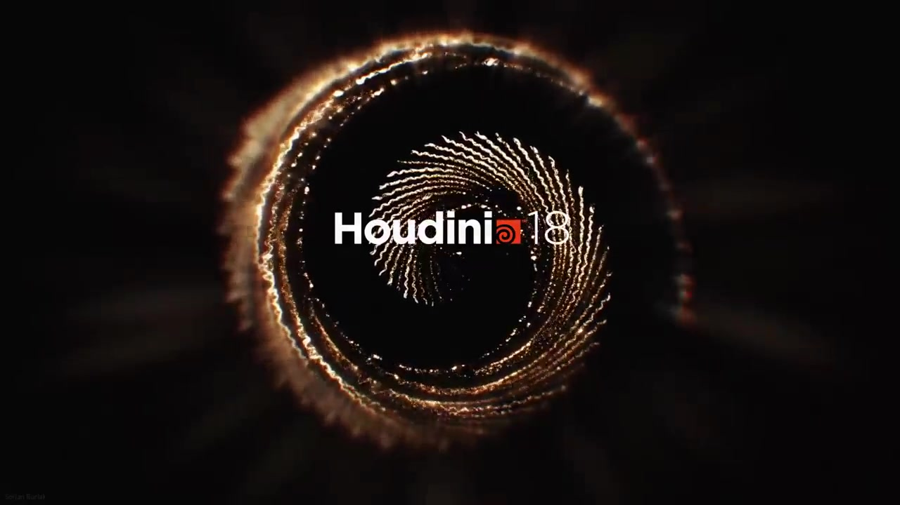


---
### Page 0
everybody to the launch of hooking 18
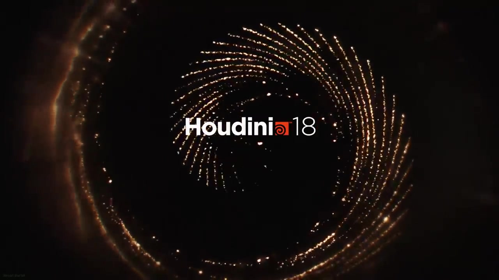

---
### Page 1
name is Chris a bear I'm the director of marketing at side effects
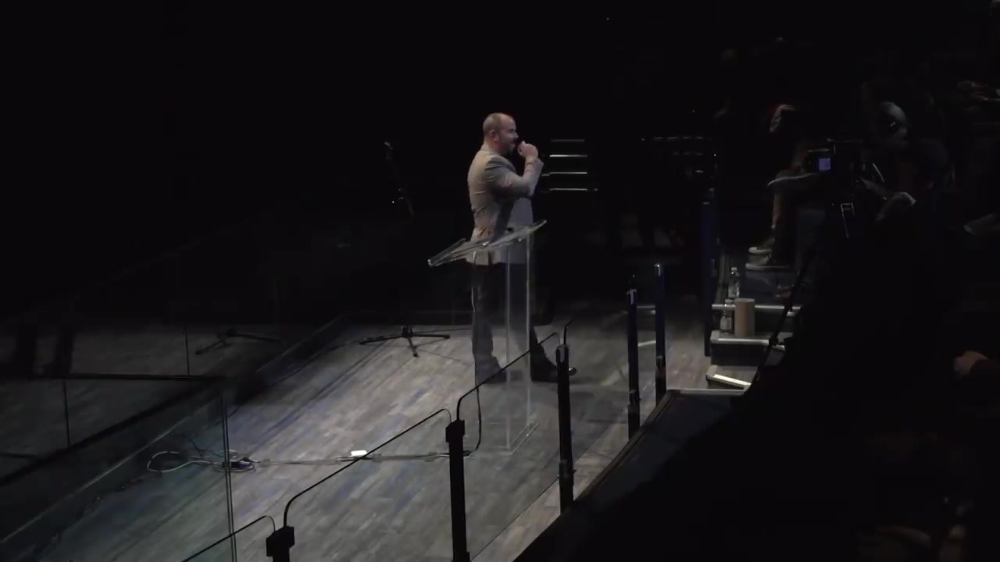

---
### Page 2
19 it's been another amazing year over the last year we've had huge growth and on our side
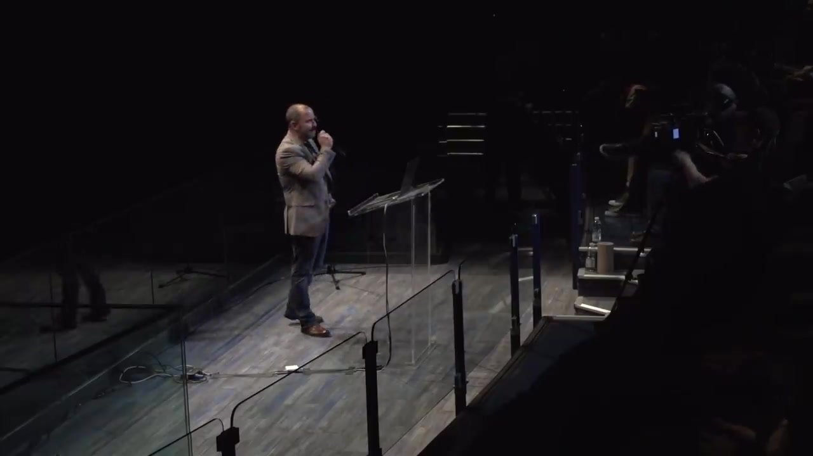

---
### Page 3
from an ever improving product
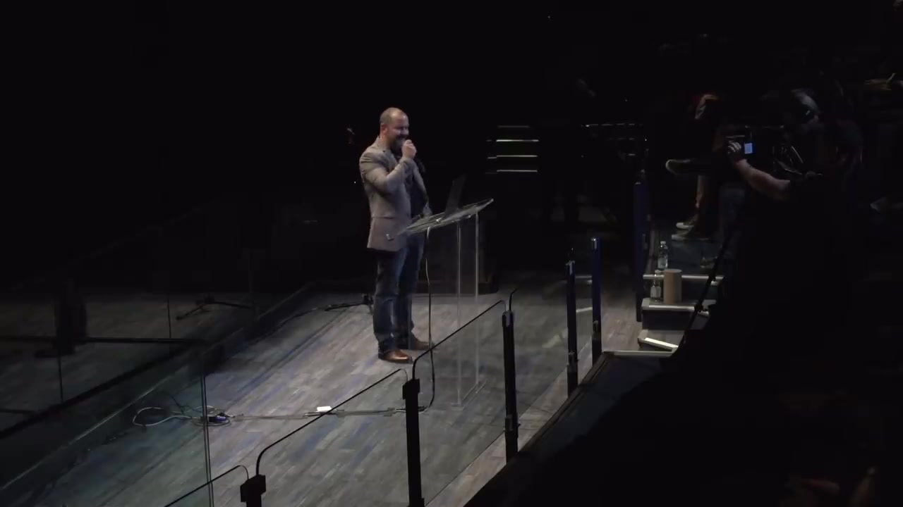

---
### Page 4
from increased awareness adoption learning material strong focus on schools where we've had amazing growth all over the world but really the growth is thanks to you the community that the heroes in the studios and the schools the freelancers around the world helping people learn helping spread the word on Houdini whether it's creating tutorials delivering presentations creating courses in the schools crafting tools or just leaning over somebody's shoulder and giving them a quick tip on how to use a note kudos huge kudos to you guys
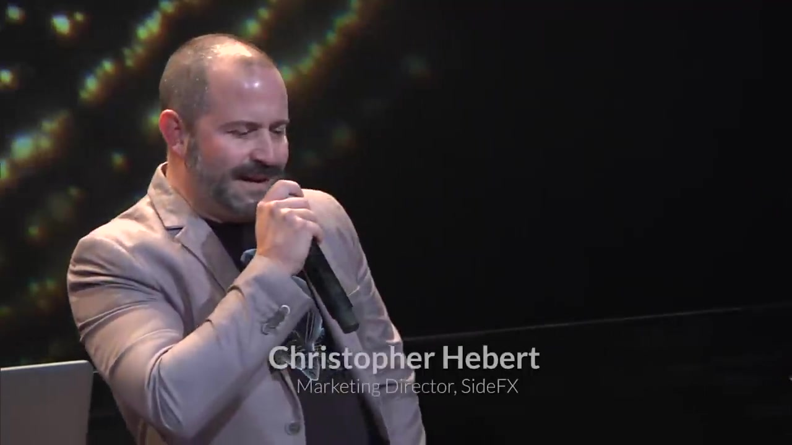

---
### Page 5
we just thank you thank you thank you for helping us deliver this product to the world and use it and create such amazing amazing work with it so to support this growth we've invested we've invested in the team and side effects we've almost doubled over the last few years in size in departments all across the company we've invested in our partnerships with technologies the integrations with technologies across the pipeline we've invested in learning material for both new users and experienced users because as we all know we're all learning all the time and especially with Houdini


---
### Page 6
with Houdini 18 there'll be a new batch of learning material which some of which will come out on day one and some of which will roll out over over the next few months
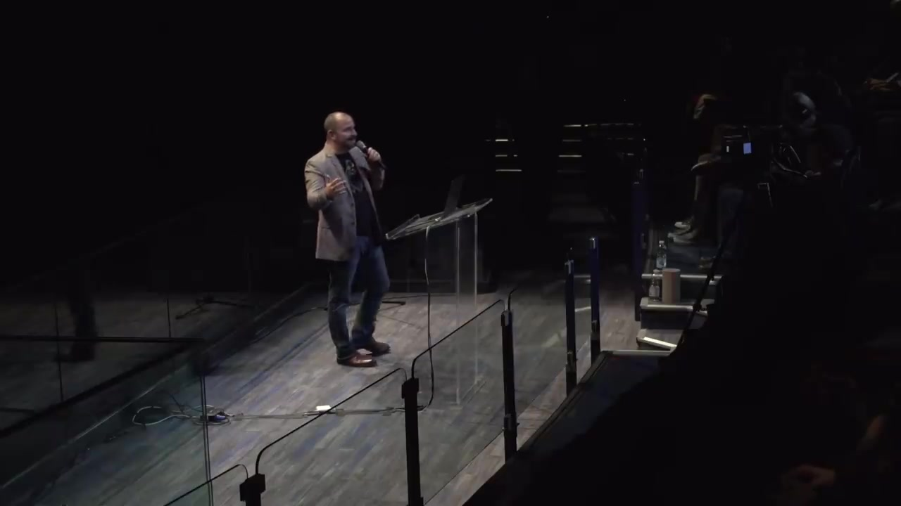

---
### Page 7
keep an eye on side effects dot com slash learn and last but absolutely not least we've invested in the product and here to tell us about all the new additions are V.P. of R.A. Kristen Barr Gable and senior product designer Scott getting good evening everyone
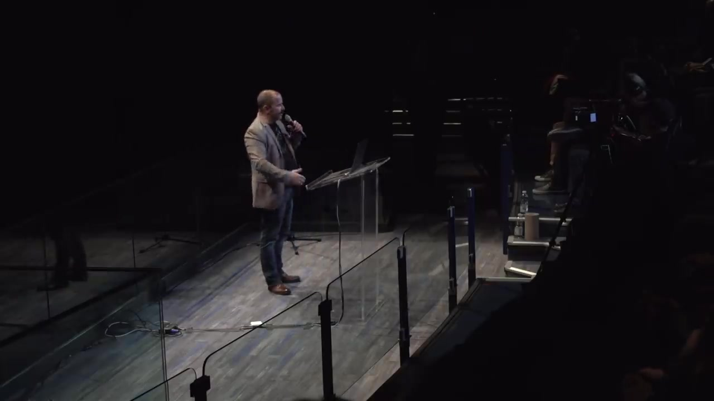

---
### Page 8
Kristen and this is Scott
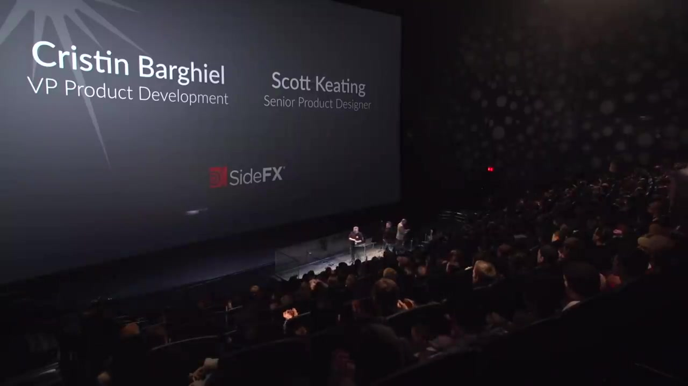

---
### Page 9
to the launch of Houdini 18 which is another might release in more ways than one


---
### Page 10
again we're particularly proud of the project Solaris which stands to become a game changer for lighting professionals but also for full on pipeline development
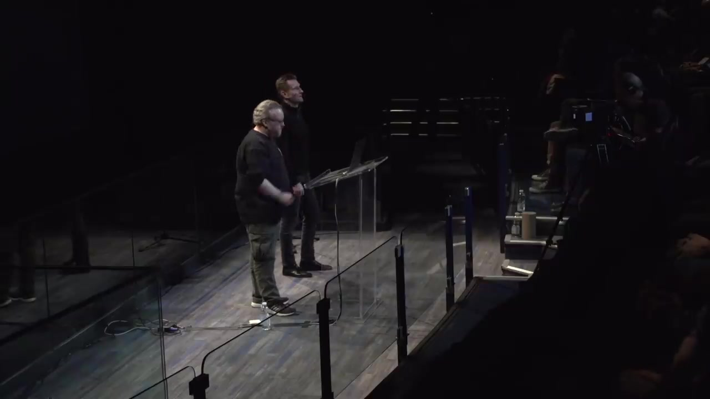

---
### Page 11
with the project Solaris and beyond
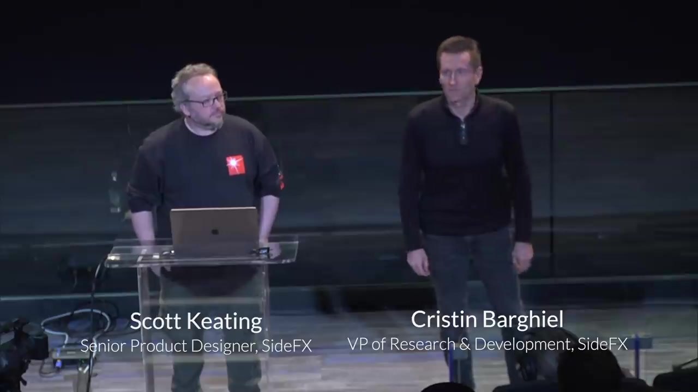

---
### Page 12
taken some pretty bold design decisions with how we give you access to the physics and Houdini and also beyond that we've taken our physics solvers through to the next level in fact we've looked at the whole landscape of solvers and Houdini for this release and we've touched all of that and we sank our teeth really deeply into interactive modelling and also computational geometry


---
### Page 13
this release
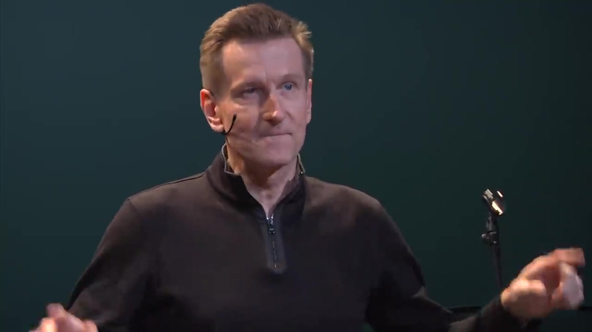

---
### Page 14
just to give you an idea which touched or created about 200 SOPs in this in this release and we're just getting going


---
### Page 15
right


---
### Page 16
let's start with the Solaris cell to just a quick entry on that pass and then pass it on to Scott


---
### Page 17
this is a unified USG based environment for lighting and layout and and rendering and looked at and what's really key about this is the USG part that's Pixar is universal scene description which runs through they through the veins of the Solaris graph which is called Lops
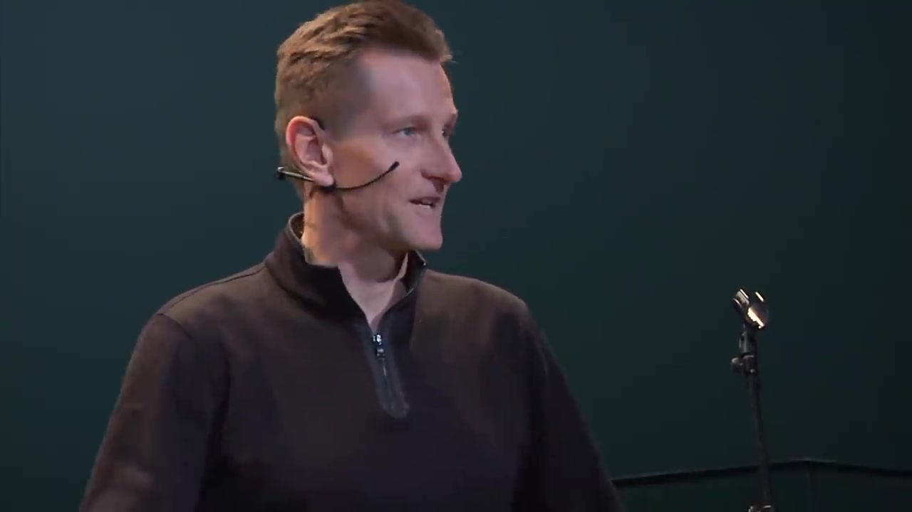

---
### Page 18
the way in other contexts as as real data
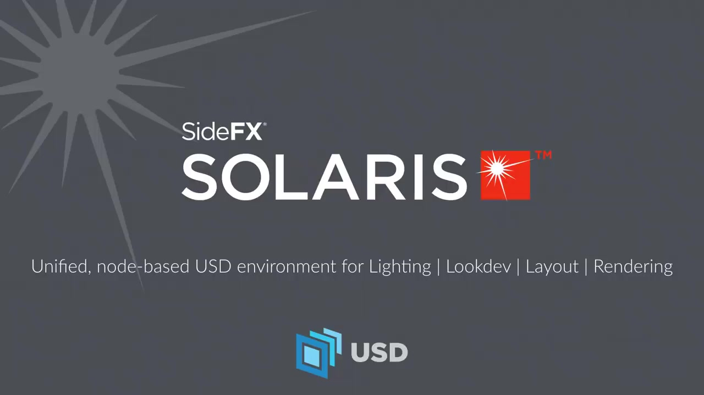


---?color=linear-gradient(180deg, white 75%, black 25%)

@title[Customize Slide Layout]

@snap[west span-50]
## Customize the Layout
@snapend

@snap[east span-50]

@snapend

@snap[south span-100 text-white]
Snap Layouts let you create custom slide designs directly within your markdown.
@snapend

---?color=linear-gradient(90deg, #5384AD 65%, white 35%)
@title[Add A Little Imagination]

@snap[north-west h4-white]
#### And start presenting...
@snapend

@snap[west span-55]
@ul[list-spaced-bullets text-white text-09]
- You will be amazed
- What you can achieve
- *With a little imagination...*
- And **GitPitch Markdown**
@ulend
@snapend

@snap[east span-45]
@img[shadow](assets/img/conference.png)
@snapend

---

@snap[north-east span-100 text-pink text-06]
Let your code do the talking!
@snapend

```sql zoom-18
CREATE TABLE "topic" (
    "id" serial NOT NULL PRIMARY KEY,
    "forum_id" integer NOT NULL,
    "subject" varchar(255) NOT NULL
);
ALTER TABLE "topic"
ADD CONSTRAINT forum_id
FOREIGN KEY ("forum_id")
REFERENCES "forum" ("id");
```

@snap[south span-100 text-gray text-08]
@[1-5](You can step-and-ZOOM into fenced-code blocks, source files, and Github GIST.)
@[6,7, zoom-13](Using GitPitch live code presenting with optional annotations.)
@[8-9, zoom-12](This means no more switching between your slide deck and IDE on stage.)
@snapend


---?image=assets/img/presenter.jpg

@snap[north span-100 h2-white]
## Now It's Your Turn
@snapend

@snap[south span-100 text-06]
[Click here to jump straight into the interactive feature guides in the GitPitch Docs @fa[external-link]](https://gitpitch.com/docs/getting-started/tutorial/)
@snapend
